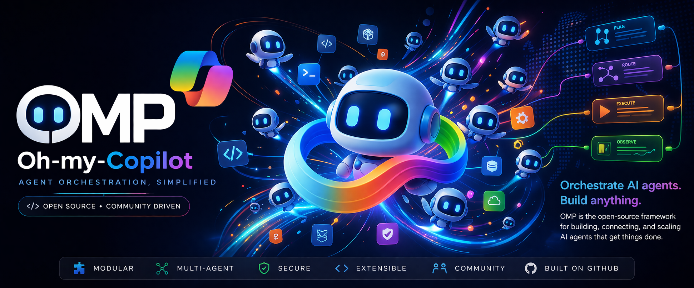

[English](README.md) | [Deutsch](README.de.md) | [Español](README.es.md) | [Français](README.fr.md) | [Italiano](README.it.md) | [日本語](README.ja.md) | [한국어](README.ko.md) | [Português](README.pt.md) | [Русский](README.ru.md) | [Türkçe](README.tr.md) | [Tiếng Việt](README.vi.md) | [中文](README.zh.md)

# oh-my-copilot
<p align="center">
  
</p>

[](https://www.npmjs.com/package/oh-my-copilot)
[](https://www.npmjs.com/package/oh-my-copilot)
[](https://opensource.org/licenses/MIT)

**Oh-My-Copilot (OMP)** e um plugin e extensao para GitHub Copilot que adiciona orquestracao moderna de workflows e capacidades de IA agentica sobre o Copilot.

---

## Inicio Rapido

```bash
# Instalacao
npm install -g oh-my-copilot

# Configuracao
omp setup
```
<p align="center">
  
</p>

<p align="center">
  
</p>
---

## Funcionalidades

- **Orquestracao Multi-Agente** - 18 agentes especializados para diferentes tarefas
- **Integracao Servidor MCP** - Conexao com servicos e ferramentas externos
- **Display HUD** - Rastreamento de estado e contexto em tempo real
- **Plugin State Manager** - Estado confiavel entre sessoes
- **30+ Skills** - Carregamento lento para funcionalidade estendida

---

## Documentacao

- [AGENTS.md](./AGENTS.md) - Registro de agentes e regras de delegacao
- [spec/](./spec/) - Especificacoes de componentes

---

## Licenca

MIT